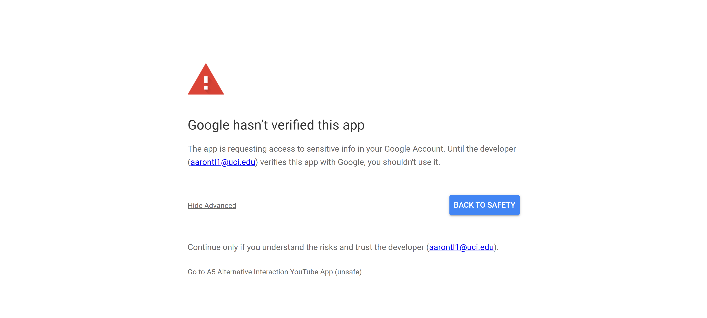
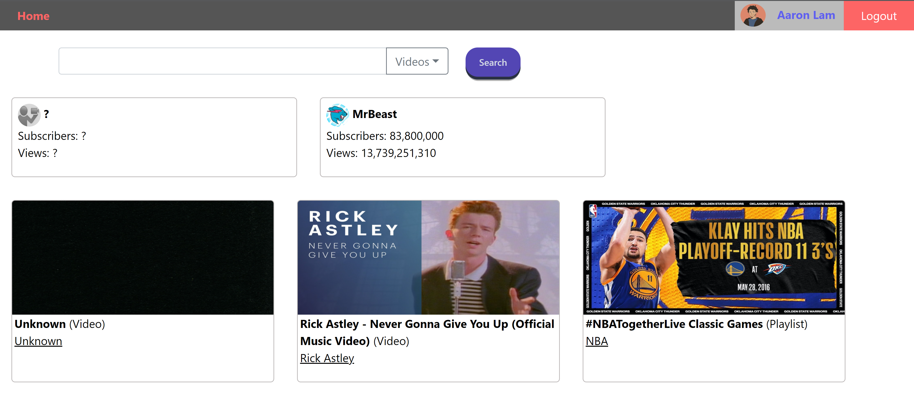
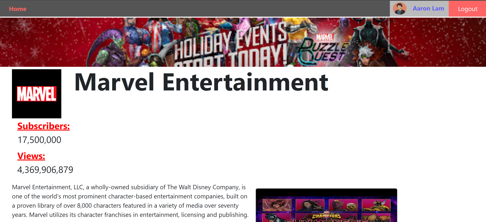
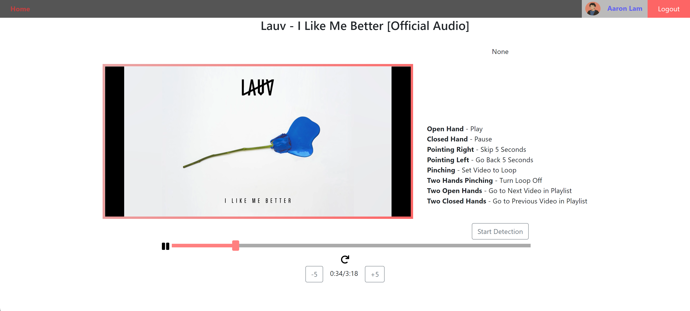
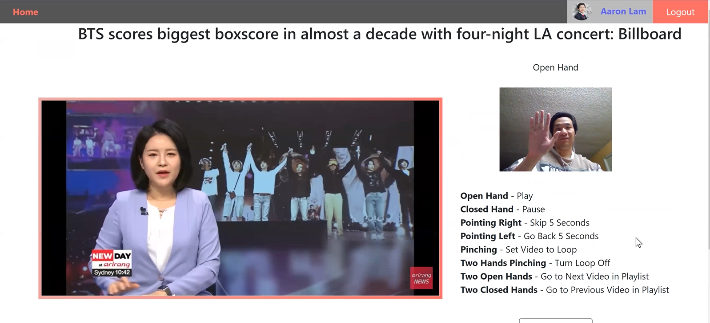

# YouTube Alternative Interaction App
An app I made with **[Edward Wu](https://github.com/Edwu29)** that allows you to search and watch videos from YouTube. Leverages **[Google's YouTube Data API](https://developers.google.com/youtube/v3)** for searching capabilities and **[YouTube's Player API](https://developers.google.com/youtube/iframe_api_reference)** for video control and watching.

## Installation
Clone the repository. You should have two directories **react-app** and **webserver**.

### react-app
To just use the video player feature, just go to **react-app** and run `npm start`.
Before your first run, call `npm install` in **react-app** to install required packages.

### webserver
In order to use the search and other data features alongside the React app, you need to run the webserver. 
**Client secrets** and **OAuth2** authorization are required to use the webserver. You can get your own by following [**this tutorial**](https://developers.google.com/identity/protocols/oauth2).

 After following the guide and finding your client secrets, make a file in webserver called `client_secret.json` and add your tokens in there like such:
```
{
    "client_id": YOUR_CLIENT_ID,
    "client_secret": YOUR_CLIENT_SECRET
}
```

To just use the video player feature, just go to **webserver** and run `npm start`.
Before your first run, call `npm install` in **webserver** to install required packages.

Another thing to note is that you might get an error message like the following:


Apps that full sponsored/autheticated by Google will show these types of errors. You can simply just expand *Show Advanced* and press *Go to APP NAME (unsafe)* to continue using the app.

## Images




